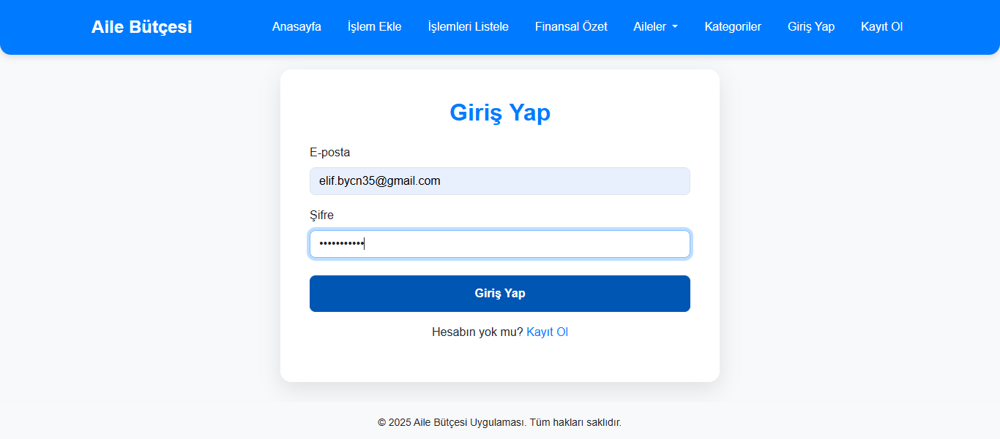
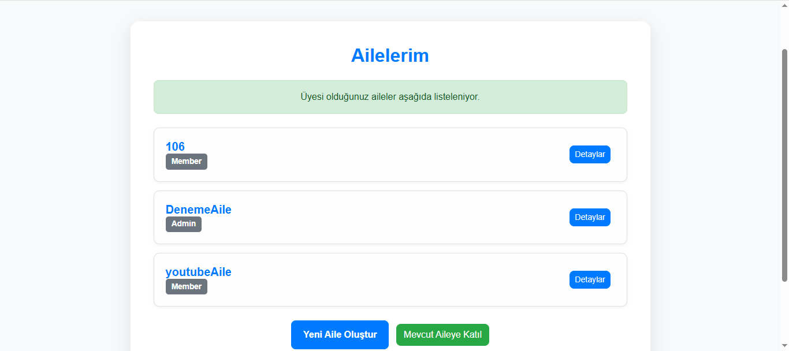
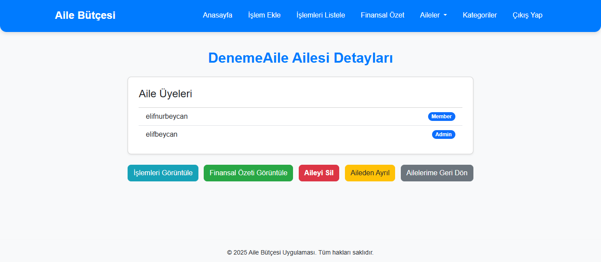
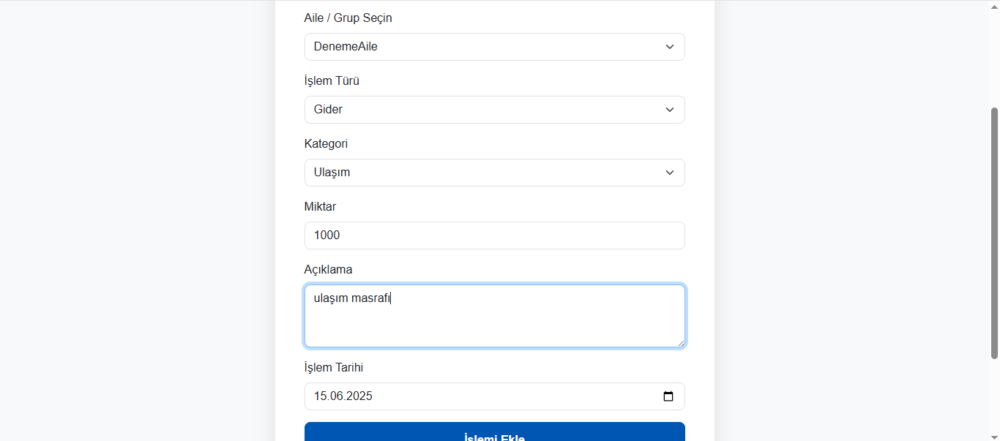
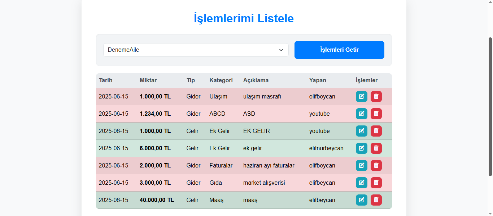
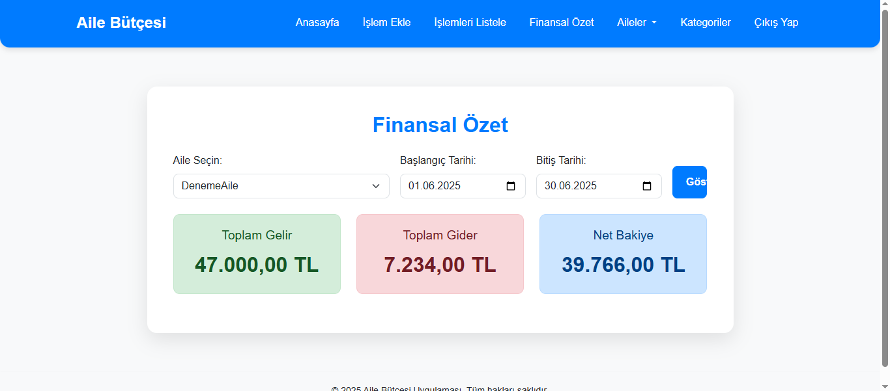
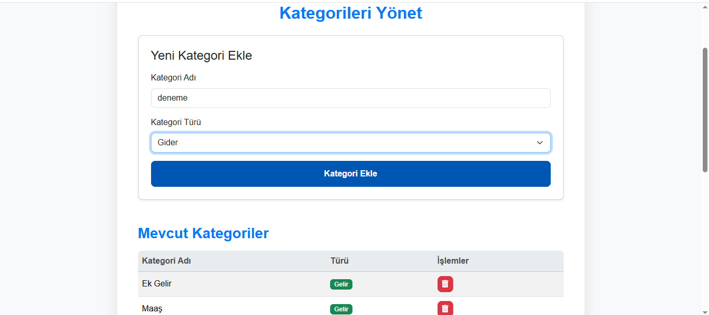
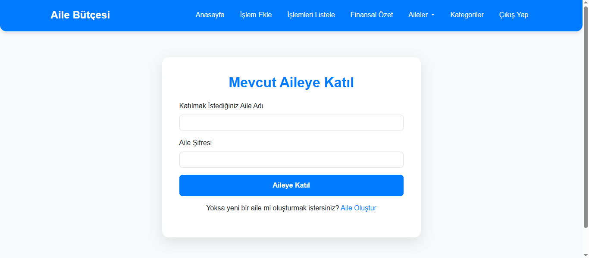
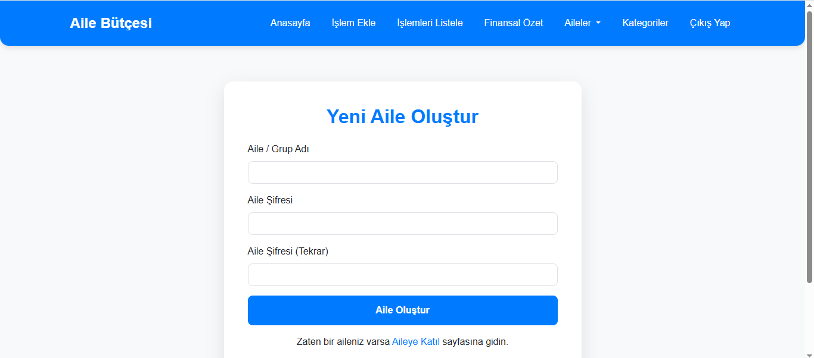

# Aile Bütçesi Yönetim Uygulaması

Bu proje, PHP ve MySQL kullanarak geliştirilmiş, birden fazla kullanıcının ortak aile bütçelerini etkili bir şekilde yönetmelerine olanak tanıyan web tabanlı bir uygulamadır. Kullanıcılar kişisel hesaplarını oluşturabilir, aile gruplarına katılabilir veya kendi ailelerini oluşturabilir, gelir ve gider işlemlerini kaydedebilir, kategorize edebilir, finansal özetlerini görüntüleyebilir ve genel bütçe durumlarını takip edebilirler.

## Proje Hakkında

Uygulama, finansal şeffaflığı artırmayı ve aile içi bütçe yönetimini kolaylaştırmayı hedefler. Temel CRUD (Create, Read, Update, Delete) operasyonlarının yanı sıra, çoklu aile üyeliği ve roller gibi gelişmiş özellikler sunar.

### Canlı Uygulamaya Gitmek İçin Tıklayın: [Aile Bütçesi Uygulaması](http://95.130.171.20/~st24360859210/dashboard.php)
### Tanıtım Videosu: [Proje Tanıtım Videosunu İzle](https://youtu.be/A976tvMBdAg)

## Özellikler

* **Kullanıcı Yönetimi:**
    * Güvenli kullanıcı kaydı.
    * E-posta ve şifre ile oturum açma (hashlenmiş şifreler).
    * Oturum yönetimi ve güvenli çıkış.
* **Aile/Grup Yönetimi:**
    * Yeni aile/grup oluşturma (şifre korumalı).
    * Mevcut ailelere katılma (şifre gereklidir).
    * Üyesi olunan aileleri listeleme.
    * Aile detaylarını ve üyelerini görüntüleme.
    * Aileden ayrılma.
    * Aileyi silme (sadece yöneticiler için ve tüm ilişkili verileri siler).
* **İşlem Yönetimi:**
    * Gelir ve gider işlemleri ekleme.
    * İşlemleri ilgili kategoriye atama.
    * İşlem açıklaması ve tarih belirleme.
    * Seçilen bir aileye ait tüm işlemleri detaylı olarak listeleme.
    * Mevcut işlemleri düzenleme.
    * İşlemleri silme (onaylı).
* **Kategori Yönetimi:**
    * Yeni gelir ve gider kategorileri ekleme.
    * Mevcut kategorileri listeleme.
    * Kullanılmayan kategorileri silme (ilişkili işlem varsa engellenir).
* **Finansal Özet:**
    * Belirli bir aile için seçilen tarih aralığındaki toplam gelir, toplam gider ve net bakiye özetini görüntüleme.
    * Kullanıcının üyesi olduğu tüm ailelerin ana sayfada (Dashboard) toplam net bakiyesini gösterme.
* **Kullanıcı Arayüzü:**
    * Duyarlı (responsive) tasarım ile mobil ve masaüstü cihazlarda uyumlu görünüm.
    * Bootstrap 5.3 ve özel CSS ile modern ve sezgisel arayüz.

## Teknolojiler

* **Backend:** PHP (yalın kodlama, framework kullanılmamıştır)
* **Veritabanı:** MySQL
* **Frontend:** HTML5, CSS3 (Bootstrap 5.3 ile), JavaScript
* **Veritabanı Bağlantısı:** MySQLi (PHP'nin yerleşik kütüphanesi)
* **Güvenlik:** `password_hash()` ve `password_verify()` ile şifre hashleme, PHP Session ile oturum yönetimi.

## Ekran Görüntüleri

* **Giriş Sayfası:**
    
* **Kayıt Sayfası:**
    

* **Anasayfa (Dashboard):**
    
* **İşlem Ekleme Formu:**
    
* **İşlemleri Listeleme:**
    

* **Ailelerim Sayfası:**
    
* **Aile Oluşturma Formu:**
    
* **Aileye Katılma Formu:**
    
* **Kategorileri Yönetme:**
    

## Katkıda Bulunma

Eğer bu projeyi geliştirmek isterseniz, lütfen bir "issue" açın veya "pull request" gönderin.

## İletişim

Sorularınız veya geri bildirimleriniz için benimle iletişime geçebilirsiniz.
